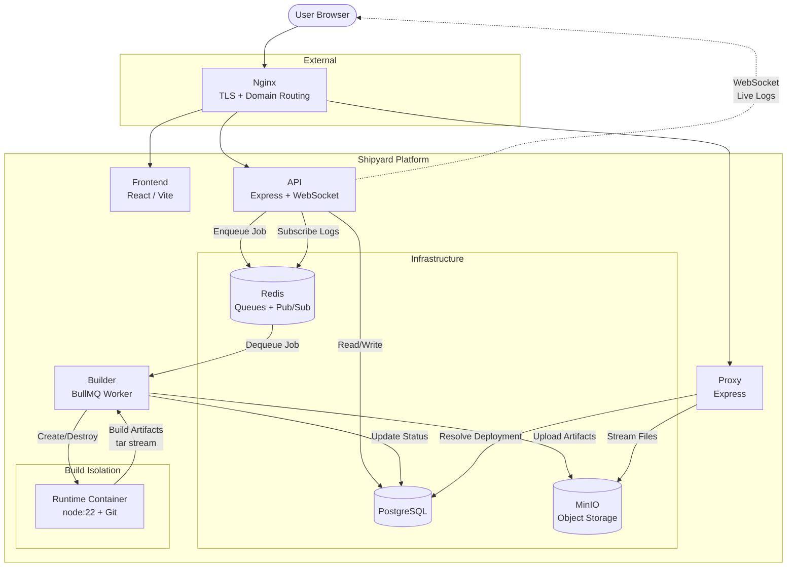
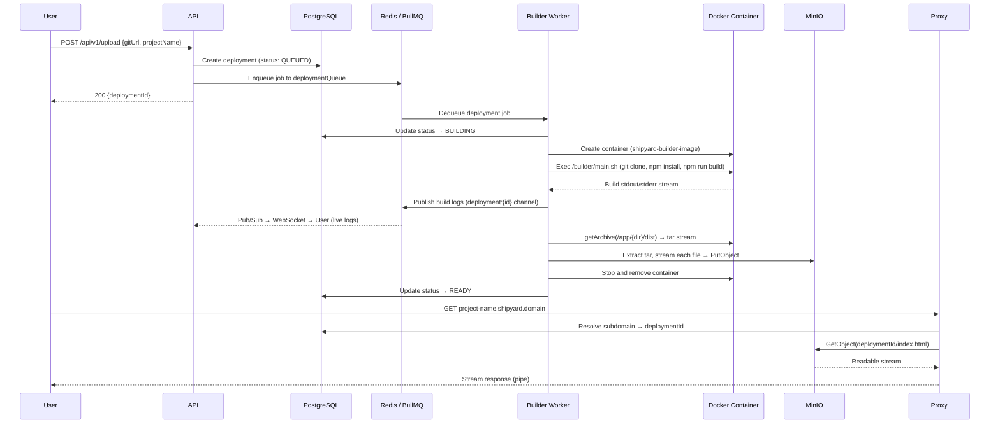
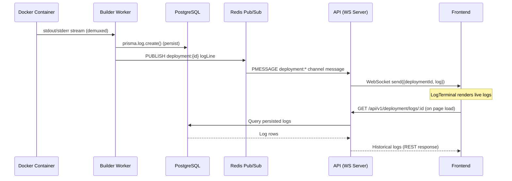

# Shipyard

A self-hosted deployment platform that takes a Git repository URL, builds it inside an isolated Docker container, uploads the build artifacts to S3-compatible object storage, and serves the deployed site through a reverse proxy with per-deployment subdomains.

Built to understand the internal mechanics of deployment platforms -- how source code moves from a repository to a running deployment, and every infrastructure decision in between.

## Table of Contents

- [Why I Built This](#why-i-built-this)
- [Architecture](#architecture)
- [Tech Stack](#tech-stack)
- [Deployment Lifecycle](#deployment-lifecycle)
- [Monorepo Structure](#monorepo-structure)
- What I Learned
  - [Docker Build Isolation](#docker-build-isolation)
  - [Streaming and Memory Management](#streaming-and-memory-management)
  - [Tar Archives and Build Artifact Extraction](#tar-archives-and-build-artifact-extraction)
  - [Object Storage and S3-Compatible APIs](#object-storage-and-s3-compatible-apis)
  - [Redis, BullMQ, and Asynchronous Processing](#redis-bullmq-and-asynchronous-processing)
  - [Build Log Pipeline](#build-log-pipeline)
  - [Reverse Proxy and Artifact Serving](#reverse-proxy-and-artifact-serving)
  - [CI/CD Pipeline](#cicd-pipeline)
  - [Production Deployment](#production-deployment)
- [Future Improvements](#future-improvements)
- [Running Locally](#running-locally)
- [Limitations](#limitations)

## Why I Built This

This project exists because I wanted to understand what happens *behind* a deployment platform, not just how to use one. Specifically:

- What happens internally when a user submits a project for deployment -- how the request is validated, persisted, and handed off to a build system.
- How source code can be cloned, built, and packaged without ever touching the host system directly.
- How asynchronous job processing and queue-based architectures decouple API request handling from long-running build operations.
- How Docker provides build isolation, preventing arbitrary user code from affecting the host or other builds.
- How object storage works as a durable layer for build artifacts, and why it is preferable to writing files to the application server's filesystem.
- How streams allow large archives and build artifacts to move through the system without buffering entire files in memory.
- How a reverse proxy can route requests to the correct deployment and stream files directly from object storage.
- How a CI/CD pipeline can build, publish, and deploy the platform itself using container images and SSH-triggered deployments.

## Architecture

Shipyard is composed of five independently deployable services connected through Redis, PostgreSQL, and MinIO:

| Service | Role |
|---|---|
| **API** | Express HTTP server + WebSocket server. Handles authentication, deployment creation, and log retrieval. Enqueues deployment jobs to BullMQ. |
| **Builder** | BullMQ worker process. Picks up deployment jobs, creates isolated Docker containers, executes builds, extracts build artifacts as tar streams, and uploads them to MinIO. |
| **Proxy** | Express HTTP server. Receives incoming requests, resolves the subdomain to a deployment ID, and streams the corresponding files from MinIO. |
| **Frontend** | React SPA (Vite). Dashboard for creating deployments, viewing deployment status, and streaming live build logs via WebSocket. |
| **Runtime Image** | A purpose-built Docker image (`shipyard-builder-image`) based on `node:22` with Git installed. Used as the isolated environment for each build. |

## Tech Stack

| Layer | Technology |
|---|---|
| Language | TypeScript |
| Runtime | Node.js 22 |
| API Framework | Express 5 |
| Frontend | React 19, Vite 8, React Router |
| Database | PostgreSQL 17 |
| ORM | Prisma (with `@prisma/adapter-pg`) |
| Validation | Zod |
| Authentication | JWT (`jsonwebtoken`), bcrypt, HTTP-only cookies |
| Job Queue | BullMQ |
| Queue Backend | Redis 7 (ioredis) |
| WebSocket | `ws` library |
| Container Management | Docker, dockerode |
| Object Storage | MinIO (S3-compatible) |
| S3 Client | `@aws-sdk/client-s3`, `@aws-sdk/lib-storage` |
| Archive Processing | `tar-stream` |
| MIME Detection | `mime` |
| Reverse Proxy (External) | Nginx |
| TLS | Let's Encrypt / Certbot |
| CI/CD | GitHub Actions |
| Container Registry | GitHub Container Registry (GHCR) |
| Hosting (Backend) | Hetzner VPS |
| Hosting (Frontend) | Vercel |
| Orchestration | Docker Compose |

Supporting infrastructure:

| Component | Role |
|---|---|
| **PostgreSQL** | Persistent storage for users, deployments, logs, and deployment metadata. |
| **Redis** | BullMQ job queue backend and Pub/Sub transport for real-time build log delivery. |
| **MinIO** | S3-compatible object storage for build artifacts. Each deployment's output files are stored as individual objects keyed by deployment ID. |
| **Nginx** | External reverse proxy handling TLS termination, HTTPS, and domain routing to the API, proxy, and frontend services. |



## Deployment Lifecycle

The complete lifecycle from user submission to a live deployment:



1. **User submits a deployment** -- the API validates the request (Zod schema), creates a deployment record in PostgreSQL with status `QUEUED`, and adds a job to the BullMQ `deploymentQueue`.
2. **Builder picks up the job** -- updates status to `BUILDING`, creates a Docker container from the runtime image with resource limits (1 CPU, 256MB memory), and executes the build script inside it.
3. **Build runs in isolation** -- the runtime container clones the Git repository, runs `npm install` and `npm run build`. Build output is streamed via Docker exec and published to Redis Pub/Sub for real-time delivery to the frontend.
4. **Artifacts are extracted and uploaded** -- Docker's `getArchive` API produces a tar stream of the `/dist` directory. The builder pipes this through `tar-stream` to extract individual files, streaming each directly to MinIO via the AWS SDK `Upload` class. No intermediate buffer is allocated for the full archive.
5. **Deployment is marked as ready** -- status is updated to `READY` in PostgreSQL. The container is stopped and removed.
6. **Proxy serves the deployment** -- incoming requests are routed by subdomain. The proxy resolves the project name to a deployment ID, fetches the requested file from MinIO via `GetObject`, and pipes the readable stream directly to the HTTP response.

## Monorepo Structure

Shipyard uses npm workspaces to manage a monorepo containing four applications and three shared packages:

```
shipyard/
├── apps/
│   ├── api/                  # Express API + WebSocket server
│   │   ├── src/
│   │   │   ├── server/       # Routes, controllers, services, middleware, schemas
│   │   │   ├── queue/        # BullMQ queue setup and job management
│   │   │   ├── ws/           # WebSocket server, manager, Pub/Sub subscriber
│   │   │   └── index.ts      # Entry point
│   │   └── Dockerfile
│   ├── builder/              # BullMQ worker for deployment builds
│   │   ├── src/
│   │   │   ├── docker/       # Dockerode client and container manager
│   │   │   ├── processor/    # Job processor function
│   │   │   ├── helper/       # Build executor, S3 upload, tar extraction
│   │   │   └── index.ts      # Worker entry point
│   │   └── Dockerfile
│   ├── proxy/                # Reverse proxy for serving deployments
│   │   ├── src/
│   │   │   ├── client/       # S3 client configuration
│   │   │   ├── services/     # File serving, deployment lookup
│   │   │   └── index.ts      # Entry point
│   │   └── Dockerfile
│   └── frontend/             # React SPA (Vite)
│       └── src/
│           ├── pages/        # Login, Dashboard, DeploymentDetails, Logs
│           ├── components/   # Navbar, Footer, DeploymentTable, LogTerminal, StatusBadge
│           ├── hooks/        # useAuth context
│           └── services/     # API client functions
├── packages/
│   ├── database/             # Prisma client, schema, migrations
│   │   ├── prisma/
│   │   │   └── schema.prisma # User, Deployment, Log models
│   │   └── src/              # PrismaClient singleton (with PrismaPg adapter)
│   ├── redis/                # Redis connection manager (ioredis singleton)
│   │   └── src/
│   │       └── redis-manager.ts
│   └── shared/               # Shared TypeScript types (jobArgs)
│       └── src/
│           └── types.ts
├── runtimes/
│   ├── Dockerfile            # Build environment image (node:22 + git)
│   └── main.sh               # Build script (clone, install, build)
├── .github/
│   └── workflows/
│       ├── ci.yml            # Build validation on push/PR
│       └── cd.yml            # Image build, push to GHCR, deploy via SSH
├── docker-compose.dev.yml    # Local development (builds from source)
├── docker-compose.prod.yml   # Production (pulls from GHCR)
├── package.json              # Root workspace configuration
└── tsconfig.json             # Root TypeScript config
```

### Why Shared Packages

The API, builder, and proxy all need access to the same database client and Redis connection. Without shared packages, each application would duplicate the Prisma configuration, connection string handling, and Redis setup. By extracting these into `@shipyard/database`, `@shipyard/redis`, and `@shipyard/shared`:

- Database schema changes propagate to all consumers automatically.
- The Prisma client is instantiated once per process, not duplicated.
- Shared types (like `jobArgs`) ensure the API and builder agree on the job payload shape at compile time.

## Docker Build Isolation

Every deployment build runs inside a dedicated Docker container. The builder service does not execute `git clone`, `npm install`, or `npm run build` on the host system.

### Runtime Image

The build environment is a custom Docker image (`shipyard-builder-image`) based on `node:22` with Git installed:

```dockerfile
FROM node:22
RUN apt-get update && apt-get install -y git && rm -rf /var/lib/apt/lists/*
COPY main.sh /builder/main.sh
RUN chmod +x /builder/main.sh
WORKDIR /app
```

The `main.sh` script is the build entrypoint:

```bash
#!/bin/bash
set -e
git clone "$1" .    # $1 = git URL
cd $2               # $2 = subdirectory (for monorepos)
npm install
npm run build
```

### Container Lifecycle

The builder uses `dockerode` to manage containers programmatically:

1. **Create** -- a new container from `shipyard-builder-image` with resource limits:
   - CPU: 1 core (`NanoCpus: 1_000_000_000`)
   - Memory: 256MB (`Memory: 256 * 1024 * 1024`)
   - The container starts with `sleep infinity` and commands are executed via `exec`.

2. **Execute** -- `container.exec()` runs `/builder/main.sh` with the Git URL and directory as arguments. Stdout and stderr are attached and demultiplexed into separate writable streams for log collection.

3. **Extract** -- after the build completes (checked via exit code), `container.getArchive()` retrieves the `/dist` directory as a tar stream.

4. **Destroy** -- the container is stopped and removed in a `finally` block, ensuring cleanup even if the build fails.

### Docker Socket

The builder container mounts the host's Docker socket (`/var/run/docker.sock:/var/run/docker.sock`), which allows it to create sibling containers on the host's Docker daemon. The `dockerode` client connects to this socket by default.

### Environment Variables

User-provided environment variables are passed to the build container via the `Env` option in `docker.createContainer()`. This allows projects that depend on build-time environment variables (e.g., API keys, feature flags) to build correctly.

### Isolation Limitations

Docker container isolation relies on Linux kernel namespaces and cgroups. This provides process, network, and filesystem isolation, but it is not equivalent to a full virtual machine boundary. A malicious user with knowledge of kernel vulnerabilities could potentially escape the container. For a production deployment platform handling untrusted code, stronger sandboxing (gVisor, Firecracker, or a VM-based approach) would be appropriate. Resource limits (CPU and memory caps) mitigate denial-of-service from individual builds, but are not a complete security boundary.

## Streaming and Memory Management

Streaming is a deliberate architectural decision throughout Shipyard. Every data path that handles build artifacts or files uses Node.js streams instead of buffering entire payloads in memory.

### The Problem with Buffering

A naive implementation might read an entire tar archive or build artifact into a `Buffer` before processing it:

```
// Anti-pattern: loading entire archive into memory
const buffer = await streamToBuffer(archiveStream);  // 200MB+ in memory
await s3.send(new PutObjectCommand({ Body: buffer }));
```

For a deployment with a large `node_modules` or heavy build output, this causes memory spikes proportional to artifact size. With multiple concurrent builds, this leads to out-of-memory conditions.

### How Shipyard Streams Data

**Build artifact upload (builder):**

The Docker `getArchive` API returns a readable stream of the container's `/dist` directory as a tar archive. This stream is piped into `tar-stream`'s extract parser, which emits individual file entries as readable streams. Each file stream is passed directly to the AWS SDK `Upload` class, which handles multipart upload to MinIO:

```
Docker getArchive → Readable tar stream → tar-stream extract
    → per-file Readable stream → AWS SDK Upload → MinIO
```

The commented-out `streamToBuffer` function in the codebase is an explicit reminder of what *not* to do -- it exists as a reference for the alternative approach that was intentionally avoided.

**File serving (proxy):**

When a user requests a deployed file, the proxy issues a `GetObject` to MinIO. The response body is a readable stream that is piped directly to the Express response:

```
MinIO GetObject → Readable stream → .pipe(res) → HTTP response to user
```

The proxy never loads the file contents into a buffer. It sets `Content-Type`, `Content-Length`, and `ETag` headers from the S3 response metadata, applies cache control (`immutable` for assets, `no-cache` for HTML), and pipes the stream. If the stream errors mid-transfer, it either destroys the response (if headers are already sent) or returns a 500 status.

**Build log streaming (builder → API → frontend):**

Docker exec output is demultiplexed into stdout and stderr using `docker.modem.demuxStream`. Each is piped into a custom `Writable` stream that persists the log line to PostgreSQL and publishes it to Redis Pub/Sub. The API subscribes to `deployment:*` channels and forwards messages to connected WebSocket clients. This allows the frontend to display build output as it happens, line by line, without polling.

### Key Concepts

- **Readable streams** produce data (S3 `GetObject` body, Docker `getArchive`, Docker exec output).
- **Writable streams** consume data (Express `res`, the custom log collector, S3 upload body).
- **Piping** (`stream.pipe(destination)`) connects a readable to a writable, handling data flow and backpressure automatically.
- **Backpressure** -- if the writable (e.g., a slow network connection) cannot keep up with the readable (e.g., MinIO delivering data faster than the client can receive it), Node.js pauses the readable until the writable drains. This prevents unbounded memory growth without any manual buffer management.

## Tar Archives and Build Artifact Extraction

When a build completes inside a Docker container, the builder needs to retrieve the output files. Docker's `container.getArchive()` API returns the contents of a directory as a **tar archive stream** -- not individual files.

### Why Tar

Tar (tape archive) packages an entire directory tree -- files, subdirectories, permissions, and metadata -- into a single byte stream. This is useful because:

- Docker's API provides directory contents only as tar streams. There is no API to list or download individual files from a running container.
- Transferring one stream is more efficient than making separate API calls for each file.
- The archive can be processed without first writing it to disk.

### Streaming Extraction

The builder uses `tar-stream` (a third-party Node.js library -- not part of the standard library) to parse the tar archive as it arrives. `tar-stream`'s `extract()` creates a transform stream that emits `entry` events for each file in the archive:

```typescript
const extract = tar.extract();

extract.on("entry", async (header, stream, next) => {
    if (header.type === "directory") {
        stream.resume();  // Skip directory entries
        next();
        return;
    }
    // stream is a Readable for this file's contents
    // Upload directly to MinIO without buffering the file
    const upload = new Upload({ ... params: { Body: Readable.from(stream) } });
    await upload.done();
    next();
});

mainStream.pipe(extract);
```

The key detail: `mainStream.pipe(extract)` connects the Docker tar stream to the extractor. As the extractor encounters each file entry, the file's content stream is piped directly into an S3 upload. At no point is the complete archive or any complete file buffered in memory.

The `next()` callback signals `tar-stream` to advance to the next entry, which provides natural flow control.

## Object Storage and S3-Compatible APIs

Shipyard uses MinIO as its object storage backend. MinIO is a self-hosted, S3-compatible object storage server -- it implements the same API surface as AWS S3, which means any client built for S3 works with MinIO without modification.

### Why Object Storage Instead of the Filesystem

Storing build artifacts directly on the application server's filesystem creates several problems:

- **Tight coupling** -- the proxy and builder must run on the same machine, or share a mounted volume.
- **No durability guarantees** -- local files are lost if the disk fails or the container is recreated.
- **Scaling constraints** -- adding a second proxy instance requires a shared filesystem or file synchronization.
- **No built-in metadata** -- content types, ETags, and cache headers must be managed manually.

Object storage decouples artifact storage from any specific service instance. The builder uploads to MinIO, the proxy reads from MinIO, and neither needs to know where the other runs.

### S3 Client Configuration

Both the builder and proxy instantiate an `S3Client` from `@aws-sdk/client-s3` configured to point at the MinIO endpoint:

```typescript
const s3 = new S3Client({
    endpoint: process.env.MINIO_ENDPOINT,  // e.g., http://minio:9000
    region: "auto",
    credentials: {
        accessKeyId: process.env.MINIO_ACCESS_KEY,
        secretAccessKey: process.env.MINIO_SECRET_KEY,
    },
    forcePathStyle: true,  // Required for MinIO (path-style vs. virtual-hosted)
});
```

`forcePathStyle: true` is necessary because MinIO uses path-style addressing (`http://minio:9000/bucket/key`) rather than virtual-hosted-style (`http://bucket.minio:9000/key`).

### Upload Path (Builder) -- `@aws-sdk/lib-storage`

The builder uses the `Upload` class from `@aws-sdk/lib-storage` rather than the lower-level `PutObjectCommand` from `@aws-sdk/client-s3`. These are two distinct packages in the AWS SDK v3 ecosystem that solve different problems:

- `@aws-sdk/client-s3` provides the standard S3 command interface (`GetObjectCommand`, `PutObjectCommand`, `DeleteObjectCommand`, etc.). `PutObjectCommand` requires the entire request body to be available upfront -- either as a `Buffer`, a `string`, or a stream with a known `Content-Length`. For large files or streams of unknown length, this is limiting.
- `@aws-sdk/lib-storage` provides the higher-level `Upload` utility, which wraps the S3 multipart upload API. `Upload` accepts a streaming `Body` without requiring a known content length. It automatically splits large uploads into parts, uploads them concurrently, and reassembles them on the server side. This is what makes it possible to pipe a tar entry stream directly into object storage without first buffering the file to determine its size.

```typescript
const upload = new Upload({
    client: s3,
    params: {
        Bucket: process.env.MINIO_BUCKET,
        Key: `${deploymentId}/${filePath}`,
        Body: Readable.from(stream),
        ContentType: mime.getType(filePath) ?? "application/octet-stream",
    },
});
await upload.done();
```

Each file from the build output is uploaded as a separate object under the deployment ID prefix. MIME types are resolved using the `mime` library.

### Download Path (Proxy) -- `@aws-sdk/client-s3`

The proxy uses `GetObjectCommand` from `@aws-sdk/client-s3` to fetch individual files. Unlike uploads, downloads do not require the `lib-storage` package because the standard `GetObjectCommand` already returns a streaming response body:

```typescript
const result = await s3.send(
    new GetObjectCommand({
        Bucket: process.env.MINIO_BUCKET,
        Key: `${deploymentId}${filePath}`,
    })
);
const stream = result.Body as NodeJS.ReadableStream;
stream.pipe(res);
```

The response body from `GetObject` is a readable stream. It is piped directly to the HTTP response without intermediate buffering.

The distinction matters: for downloads, the standard SDK v3 client commands are sufficient because `GetObject` naturally returns a stream. For uploads from streams of unknown length, the higher-level `Upload` utility from `lib-storage` is necessary because it handles chunking and multipart orchestration that `PutObjectCommand` does not provide on its own.

## Redis, BullMQ, and Asynchronous Processing

Redis serves two distinct roles in Shipyard: as the backing store for BullMQ job queues and as a Pub/Sub transport for real-time build log delivery.

### Why Asynchronous Processing

A deployment build involves cloning a repository, installing dependencies, compiling the project, and uploading artifacts. This can take minutes. If the API handled builds synchronously, every deployment request would hold an HTTP connection open for the duration of the build, blocking the API server and timing out most clients.

Instead, the API creates a deployment record, enqueues a job, and returns immediately with the deployment ID. The build happens asynchronously in the builder worker process.

### Queue Architecture

The API creates a `Queue` connected to Redis:

```typescript
export const deploymentQueue = new Queue(
    "deploymentQueue",
    { connection: redis_class.getQueueConnection() }
);
```

When a deployment is submitted, the `QueueManager` adds a job with retry configuration:

```typescript
deploymentQueue.add("upload", {
    deploymentId, projectName, gitUrl, directory, env
}, {
    attempts: 3,
    backoff: { type: "exponential", delay: 3000 },
    removeOnFail: 100,
    removeOnComplete: 100,
});
```

- **3 retry attempts** with exponential backoff (3s, 6s, 12s) handle transient failures like network issues during `git clone`.
- `removeOnFail: 100` and `removeOnComplete: 100` keep the last 100 failed/completed jobs in Redis for debugging, preventing unbounded memory growth.

The builder process creates a `Worker` that consumes from the same queue:

```typescript
const upload_worker = new Worker(
    "deploymentQueue",
    uploader,   // processor function
    {
        connection: redis_class.getQueueConnection(),
        maxStalledCount: 2,
        stalledInterval: 60 * 1000,
        lockDuration: 10 * 60 * 1000,
    }
);
```

- `lockDuration: 10 minutes` gives builds sufficient time to complete before BullMQ considers the job stalled.
- `maxStalledCount: 2` allows a job to be retried twice if the worker crashes mid-build.

### Job Lifecycle

Each job moves through well-defined states:

```
QUEUED → BUILDING → READY
                  → FAILED
```

The processor function updates the deployment status in PostgreSQL at each transition. If the build throws an error, the `catch` block sets the status to `FAILED` and re-throws to trigger BullMQ's retry logic.

### Redis Pub/Sub for Build Logs

The builder publishes build output lines to Redis channels named `deployment:{deploymentId}`:

```typescript
publisher.publish(`deployment:${deploymentId}`, data);
```

The API subscribes to `deployment:*` using `psubscribe` and forwards matching messages to WebSocket clients. This decouples the builder from the API -- the builder only needs to know about Redis, not about connected WebSocket clients.

### Redis Connection Management

The `@shipyard/redis` package exposes a `RedisManager` singleton that maintains two separate `ioredis` connections:

- **General connection** -- used for Pub/Sub operations.
- **Queue connection** -- configured with `maxRetriesPerRequest: null` as required by BullMQ (BullMQ needs a connection that never gives up on blocked commands like `BRPOPLPUSH`).

## Build Log Pipeline

Shipyard captures, persists, and delivers build logs in real time. Every line of output produced inside a Docker container is simultaneously written to PostgreSQL for permanent storage and published to Redis Pub/Sub for live delivery to connected browsers via WebSocket.

### Why WebSockets Instead of Polling

Build log output is continuous and unpredictable in timing. Polling at fixed intervals would either miss log lines (if the interval is too long) or waste bandwidth (if too short). WebSockets provide a persistent bidirectional channel where the server pushes log lines as soon as they arrive.

### End-to-End Architecture



```
Docker Container (stdout/stderr)
    │
    ▼
docker.modem.demuxStream()
    ├── stdoutBox (custom Writable)
    └── stderrBox (custom Writable)
            │
            ├──── prisma.log.create()  →  PostgreSQL (persistence)
            │
            └──── publisher.publish()  →  Redis Pub/Sub
                                              │
                                              ▼
                                    API subscriber (psubscribe)
                                              │
                                              ▼
                                    websocketManager.sendToUser()
                                              │
                                              ▼
                                    Frontend (WebSocket onmessage)
                                              │
                                              ▼
                                    LogTerminal component
```

### Step 1: Capture -- Docker Exec Demultiplexing

When the builder runs `/builder/main.sh` inside the Docker container, the exec stream carries both stdout and stderr multiplexed into a single stream (a Docker protocol detail when `Tty: false`). The builder uses `docker.modem.demuxStream()` to split this into two separate channels:

```typescript
docker.modem.demuxStream(
    stream,    // multiplexed exec output
    stdoutBox, // receives stdout chunks
    stderrBox  // receives stderr chunks
);
```

Setting `Tty: false` is critical here. With `Tty: true`, Docker merges stdout and stderr into a single stream with no framing, making demultiplexing impossible. With `Tty: false`, Docker prepends an 8-byte header to each frame indicating the stream type (stdout vs. stderr) and the frame length, which `demuxStream` uses to route chunks correctly.

### Step 2: Dual-Write -- Custom Writable Streams

Both `stdoutBox` and `stderrBox` are custom `Writable` streams that perform the same two operations on every chunk:

```typescript
const stdoutBox = new Writable({
    async write(chunk, encoding, callback) {
        const data = chunk.toString();
        // 1. Persist to PostgreSQL
        await prisma.log.create({
            data: { deploymentId, message: data }
        });
        // 2. Publish to Redis for real-time delivery
        publisher.publish(`deployment:${deploymentId}`, data);
        callback();
    },
});
```

This dual-write strategy means every log line is simultaneously:

- **Persisted** -- written to the `Log` table in PostgreSQL, creating a permanent record that survives process restarts, Redis eviction, and WebSocket disconnections.
- **Published** -- sent to a Redis Pub/Sub channel for immediate delivery to any connected frontend clients.

The `callback()` call at the end signals that the writable is ready for the next chunk. Because the `write` function is `async`, backpressure is applied naturally -- if PostgreSQL or Redis is slow, the Docker exec stream pauses until the write completes.

### Step 3: Persistence -- The Log Model

The `Log` model in Prisma stores each log line as a separate row:

```prisma
model Log {
  id           String     @id @default(cuid())
  deploymentId String
  message      String
  createdAt    DateTime   @default(now())
  deployment   Deployment @relation(fields: [deploymentId], references: [id], onDelete: Cascade)
  @@index([deploymentId])
}
```

Key design decisions:

- **One row per chunk** -- each `write()` invocation creates a separate row. Chunks correspond to Docker exec output frames, which are typically one or a few lines.
- **Indexed by `deploymentId`** -- allows efficient retrieval of all logs for a given deployment.
- **Cascade delete** -- when a deployment is deleted, all its logs are automatically removed.
- **`createdAt` timestamp** -- preserves the ordering of log output, since `cuid()` IDs are not guaranteed to sort chronologically.

### Step 4: Real-Time Delivery -- Redis → WebSocket → Browser

The published message travels through three hops:

1. **Redis Pub/Sub** -- the builder publishes to `deployment:{deploymentId}`. This is a fire-and-forget operation; if no subscriber is listening, the message is silently dropped (which is fine because the log is already persisted in PostgreSQL).

2. **API subscriber** -- a dedicated Redis connection (duplicated from the main connection to avoid blocking) uses `psubscribe("deployment:*")` to listen on all deployment channels. On each `pmessage`, it extracts the deployment ID from the channel name and calls `wsInstance.sendToUser()`. This design means the builder and the API do not need to communicate directly -- the builder publishes to Redis, the API subscribes from Redis, and either can be restarted independently.

3. **WebSocket delivery** -- the `websocketManager` looks up all connected sockets for that deployment ID and sends a JSON payload `{ deploymentId, log }` validated against a Zod schema. Dead sockets (`readyState !== OPEN`) are terminated and removed from the set.

### WebSocket Server

The WebSocket server is attached to the same HTTP server as the Express API using the `ws` library:

```typescript
const wss = new WebSocketServer({ server, verifyClient(info, cb) {
    if (allowedOrigins.includes(info.origin)) cb(true);
    else cb(false);
}});
```

On connection, the server:

1. Extracts the user ID from the JWT in the cookie header.
2. Extracts the deployment ID from the URL path.
3. Verifies that the deployment belongs to the authenticated user (PostgreSQL query).
4. Registers the WebSocket in a `websocketManager` singleton that maps deployment IDs to sets of connected sockets.

The `websocketManager` is a singleton that tracks active connections per deployment:

```typescript
class websocketManager {
    private userList: Map<string, Set<WebSocket>> = new Map();
    // addUserConnections, removeUser, sendToUser...
}
```

`sendToUser` validates outgoing messages against a Zod schema before sending, and terminates dead sockets that are no longer in `OPEN` state.

### Step 5: Display -- Two-Source Rendering

The frontend's `LogsPage` component establishes a WebSocket connection to `ws://{API_HOST}/{deploymentId}` on mount and merges two log sources:

1. **Historical logs** -- fetched via REST API (`GET /api/v1/deployment/logs/:id`) on page load. These are the persisted `Log` rows from PostgreSQL, providing all output from before the page was opened.

2. **Live logs** -- received via WebSocket in real time. These are appended to a separate `liveLogs` state array as they arrive. The connection status (connecting, connected, disconnected) is shown to the user.

The `LogTerminal` component renders both sources sequentially -- historical logs first (with database-assigned IDs), then live logs (with index-based keys). Line numbers continue sequentially across both sources:

```typescript
// Historical logs: lines 1 through logs.length
{logs.map((log, i) => (
    <span className="line-number">{i + 1}</span>
))}

// Live logs: lines logs.length+1 onward
{liveLogs.map((msg, i) => (
    <span className="line-number">{logs.length + i + 1}</span>
))}
```

This two-source approach ensures that a user who opens the logs page mid-build sees the complete output: everything that already happened (from PostgreSQL) plus everything happening now (from the WebSocket). A user who opens the page after the build finishes sees the full log from PostgreSQL alone, with the WebSocket contributing nothing.

### Why Dual-Write Instead of Read-Through

An alternative architecture would skip PostgreSQL writes during the build and instead read the logs from Redis (e.g., using a Redis Stream or List). The dual-write approach was chosen because:

- **Redis Pub/Sub is ephemeral** -- messages are delivered only to currently connected subscribers. If no one is listening, the message is lost. Persisting to PostgreSQL first guarantees no log line is ever dropped.
- **No additional read path** -- the REST API for historical logs queries PostgreSQL directly. There is no need for a separate log retrieval mechanism.
- **Simplicity** -- the builder writes once to both destinations in the same function. There is no need for a separate log aggregation service or a consumer that drains Redis into PostgreSQL after the fact.

The tradeoff is write amplification: every log line incurs both a PostgreSQL `INSERT` and a Redis `PUBLISH`. For the expected build volume (seconds to low minutes of output per deployment), this is not a bottleneck. For higher throughput, batching PostgreSQL inserts (noted in Future Improvements) would reduce per-line overhead.

## Reverse Proxy and Artifact Serving

The proxy service is the entry point for accessing deployed sites. It translates subdomain-based URLs into object storage lookups and streams files to the user.

### Request Flow

```
User requests: https://my-project.shipyard.domain/assets/style.css
        │
        ▼
┌──────────────────┐
│      Nginx       │  TLS termination, domain routing
│ (External Proxy) │  Routes *.shipyard.domain → Shipyard proxy (port 3020)
└────────┬─────────┘
         │
         ▼
┌──────────────────┐
│  Shipyard Proxy  │  Extracts subdomain ("my-project") from Host header
│   (Express)      │  Queries PostgreSQL for deployment with that projectName
│                  │  Fetches /assets/style.css from MinIO
│                  │  Pipes S3 readable stream → HTTP response
└────────┬─────────┘
         │
         ▼
┌──────────────────┐
│      MinIO       │  Returns object as readable stream
│ (Object Storage) │
└──────────────────┘
```

### Subdomain-Based Routing

The proxy extracts the subdomain from `req.hostname`:

```typescript
const hostname = req.hostname;
const deploymentId = await getDeploymentId(hostname.split(".")[0]);
```

The `getDeploymentId` function queries PostgreSQL for a deployment matching the extracted project name and returns the deployment ID used as the object key prefix in MinIO.

### SPA Fallback

For single-page applications, the proxy implements client-side routing support. If a requested path does not match an object in MinIO and is not a static asset (determined by file extension), the proxy falls back to serving `/index.html`:

```typescript
if ((err as any).Code === 'NoSuchKey') {
    return await serveFiles(deploymentId, res, "/index.html");
}
```

This allows routes like `/about` or `/dashboard` to work correctly in SPAs that handle routing on the client side.

### Cache Strategy

The proxy applies differentiated cache headers:

- **HTML files**: `Cache-Control: no-cache` -- always revalidated to ensure users see the latest deployment.
- **Static assets** (JS, CSS, images): `Cache-Control: public, max-age=31536000, immutable` -- cached aggressively because hashed filenames change on rebuild.

### Stream Error Handling

The proxy handles mid-stream errors by checking whether response headers have already been sent:

```typescript
stream.on("error", (error) => {
    if (res.headersSent) {
        res.destroy(error);  // Can't send a new status code; destroy the connection
    } else {
        res.status(500).send("Stream error");
    }
});
```

This is important because once `pipe()` starts writing, you can no longer change the HTTP status code. The check prevents an unhandled error from crashing the process.

## CI/CD Pipeline

Shipyard's own infrastructure is deployed through a CI/CD pipeline built on GitHub Actions.

### Continuous Integration

The CI workflow runs on every push and pull request to `main`:

```yaml
jobs:
  Continuous-Integration:
    runs-on: ubuntu-latest
    steps:
      - uses: actions/checkout@v4
      - uses: actions/setup-node@v4
        with: { node-version: 22, cache: npm }
      - run: npm ci
      - run: npm run build
```

This validates that the entire monorepo compiles successfully -- all shared packages and all applications.

### Continuous Deployment

The CD workflow runs on push to `main` (after CI succeeds implicitly by being in the same commit):

1. **Build Docker images** -- each service (API, builder, proxy) and the runtime image are built using `docker/build-push-action`.
2. **Push to GHCR** -- images are pushed to GitHub Container Registry under `ghcr.io/abhishek8841/`:
   - `shipyard-app-api:latest`
   - `shipyard-app-builder:latest`
   - `shipyard-app-proxy:latest`
   - `shipyard-builder-image:latest`
3. **Deploy via SSH** -- the workflow connects to the Hetzner VPS using `appleboy/ssh-action` and runs:
   ```bash
   cd ~/shipyard
   docker compose -f docker-compose.prod.yml pull
   docker compose -f docker-compose.prod.yml up -d
   ```

### Why Not Build on the VPS

Building Docker images directly on the production VPS consumes CPU and memory during the build, potentially affecting running services. It also requires the full source code and build toolchain to be present on the VPS. By building in GitHub Actions and pulling pre-built images, the VPS only needs Docker and the compose file. Deployments become a fast image pull rather than a full rebuild.

### GHCR as the Image Registry

GitHub Container Registry is used because it integrates directly with GitHub Actions authentication (`GITHUB_TOKEN`), requires no additional registry configuration, and keeps container images co-located with the source code.

## Production Deployment

### Infrastructure

| Component | Host | Purpose |
|---|---|---|
| API, Builder, Proxy, Redis, PostgreSQL, MinIO | Hetzner VPS | Backend services via Docker Compose |
| Frontend | Vercel | Static site hosting for the React SPA |
| Nginx | Hetzner VPS | TLS termination, HTTPS, domain routing |
| TLS Certificates | Let's Encrypt / Certbot | Automated certificate provisioning and renewal |

### Request Flow

```
User's browser
    │
    ▼
DNS resolves shipyard.abatra.me → Hetzner VPS IP
    │
    ▼
Nginx (port 443)
    ├── shipyard.abatra.me → Vercel (frontend)
    ├── api.shipyard.abatra.me → localhost:3010 (API)
    └── *.app.shipyard.abatra.me → localhost:3020 (Proxy)
```

### Docker Compose (Production)

The production compose file pulls pre-built images from GHCR instead of building locally. Services declare health checks and dependency ordering:

- PostgreSQL must be healthy before the API or builder starts.
- Redis must be healthy before the API or builder starts.
- MinIO must be healthy before the builder or proxy starts.

The API container runs Prisma migrations on startup (`prisma migrate deploy`) before starting the Node.js process, ensuring the database schema is always up to date.

Persistent data is stored in named Docker volumes (`postgres-data`, `minio_data`) so it survives container restarts.


## Future Improvements

- **Git commit SHA image tags** -- tag Docker images with the Git commit SHA instead of (or in addition to) `latest` to create immutable, traceable image versions. Currently all images use the `latest` tag, which makes it impossible to identify exactly which commit a running container was built from.
- **Automated rollback** -- with SHA-based image tags in place, detect failed deployments and automatically revert to the previous working image tag. This is not currently implemented and depends on moving away from the `latest`-only tagging strategy.
- **Prometheus and Grafana** -- add monitoring and observability to the platform. Prometheus would scrape metrics from each service (API latency, queue depth, build duration, memory usage, container lifecycle events), and Grafana would provide dashboards for visualizing system health. This is not currently implemented.
- **Kubernetes** -- replace Docker Compose with Kubernetes for container orchestration, enabling horizontal pod autoscaling, rolling deployments, self-healing (automatic container restart on failure), and resource quota management across namespaces. This is not currently implemented -- the platform currently runs on a single VPS with Docker Compose.
- **Kafka** -- introduce Apache Kafka as a distributed event streaming platform for future event-driven architecture. Kafka would enable durable, ordered event logs for deployment lifecycle events, build log aggregation, and decoupled communication between services at higher throughput than Redis Pub/Sub. This is not currently implemented.
- **Stronger build sandboxing** -- replace Docker with gVisor, Firecracker, or a VM-based isolation layer for running untrusted build commands.
- **Build caching** -- cache `node_modules` or build layers between deployments of the same project to reduce build times.
- **Multi-framework support** -- detect and support build frameworks beyond npm (e.g., yarn, pnpm, static site generators).
- **Custom domains** -- allow users to map their own domains to deployments.
- **Horizontal scaling** -- run multiple builder workers to process builds concurrently.
- **Outbox pattern** -- the codebase contains a comment noting the outbox pattern as a consideration for ensuring deployment creation and job enqueue happen atomically.
- **Deployment previews** -- support branch-based preview deployments.
- **Build log persistence optimization** -- batch log inserts instead of one `prisma.log.create` per output line.
- **Rate limiting and abuse prevention** -- limit deployment frequency per user.

## Running Locally

### Prerequisites

- Node.js 22+
- Docker and Docker Compose
- Git

### Setup

```bash
# Clone the repository
git clone https://github.com/Abhishek8841/shipyard.git
cd shipyard

# Create environment file
cp .env.example .env
# Edit .env with your values

# Start infrastructure services and build application images
docker compose -f docker-compose.dev.yml up --build

# The runtime image must be available locally or pulled from GHCR
docker pull ghcr.io/abhishek8841/shipyard-builder-image:latest
```

### Environment Variables

| Variable | Description |
|---|---|
| `POSTGRES_PASSWORD` | PostgreSQL password |
| `MINIO_ROOT_USER` | MinIO root username |
| `MINIO_ROOT_PASSWORD` | MinIO root password |
| `JWT_SECRET` | Secret for signing JWT tokens |
| `MINIO_BUCKET` | Object storage bucket name |
| `MINIO_ACCESS_KEY` | MinIO access key (same as `MINIO_ROOT_USER`) |
| `MINIO_SECRET_KEY` | MinIO secret key (same as `MINIO_ROOT_PASSWORD`) |

### Services

| Service | Port |
|---|---|
| API | `localhost:3010` |
| Proxy | `localhost:3020` |
| MinIO Console | `localhost:9001` |
| MinIO API | `localhost:9000` |
| Frontend (dev) | `localhost:4000` (run separately with `npm run dev` in `apps/frontend`) |

## Limitations

- Only supports Node.js projects that produce a `dist/` directory via `npm run build`.
- Single builder worker -- builds are processed sequentially.
- No build caching -- every deployment starts from a clean `git clone` and fresh `npm install`.
- Docker socket sharing (`/var/run/docker.sock`) gives the builder container full access to the host Docker daemon.
- The `latest` image tag strategy means there is no built-in mechanism for rollback.
- No rate limiting on the API.
- No multi-tenancy isolation at the network level -- all user builds share the same Docker daemon and MinIO instance.

---

Made by Abhishek Batra. If you are building something similar, reach out.
